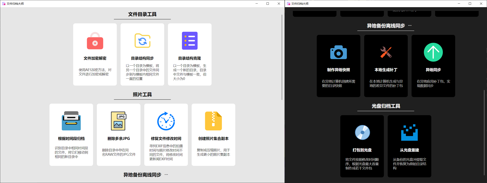

# 文件归档大师

## 简介

这是一套协助用户对文件进行处理、管理、备份、同步的工具集。

在开始这个项目之前的许多年，我已经陆续写了很多的用于备份、同步、管理文件或照片的软件，包括：

- [文件自动备份系统](https://github.com/autodotua/FileBackuper_New)
- 文件批量操作
- [异地备份离线同步](https://github.com/autodotua/OffsiteBackupOfflineSync)
- [照片瘦身工具](https://github.com/autodotua/PhotoSlimming)
- [照片归档工具](https://github.com/autodotua/PhotoArchivingTools)
- [光盘归档工具](https://github.com/autodotua/DiscArchivingTool)
- 控制台小程序集
- 文件归位器
- 文件夹加密

这些工具功能各异，界面各不相同，技术水平差异很大，操作方式也不尽相同。因此，我希望通过本项目，把这些工具进行整合，使用跨平台的[Avalonia](https://github.com/AvaloniaUI/Avalonia)技术承载GUI。

## 工具

### 照片工具（`PhotoArchive`）

一套用来解决照片（以及其他类型文件）在预处理、整理、存档、浏览等环节存在问题的自动化工具

| 工具名           | 用途                                                         | 期望解决的问题                                               | 类名前缀             | 原项目                                                       | 开发进度 |
| ---------------- | ------------------------------------------------------------ | ------------------------------------------------------------ | -------------------- | ------------------------------------------------------------ | -------- |
| 根据时间段归档   | 识别目录中相同时间段的文件，将它们移动到相同的新目录中       | 例如对于航拍照片，多次起飞的照片和视频会混在一起。通过该工具，可以通过拍摄时间来自动将不同航次的照片和视频进行归类。 | `TimeClassify`       | [照片归档工具](https://github.com/autodotua/PhotoArchivingTools) | 已完成   |
| 删除多余JPG      | 删除目录中存在同名RAW文件的JPG文件                           | 当拍摄了RAW+JPG格式的照片时，若决定处理RAW文件，那么JPG格式是多余的，需要删除。 | `UselessJpgCleaner`  | [照片归档工具](https://github.com/autodotua/PhotoArchivingTools) | 已完成   |
| 修复文件修改时间 | 寻找EXIF信息中的拍摄时间与照片修改时间不同的文件，将修改时间更新闻EXIF时间 | 对照片进行处理后，文件修改时间会更新，不利于部分软件的照片排序，需要从EXIF中读取实际拍摄时间，对文件修改时间进行更新。 | `RepairModifiedTime` | [照片归档工具](https://github.com/autodotua/PhotoArchivingTools) 控制台小程序集 | 已完成   |
| 创建照片集合副本 | 复制或压缩照片，用于生成更小的照片集副本                     | 需要将硬盘中整理后的部分照片复制到手机中以便随时查看，但可能存在文件过大放不进手机、只需要部分目录中的文件、只需要部分类型文件等需求。 | `PhotoSlimming`      | [照片归档工具](https://github.com/autodotua/PhotoArchivingTools) [照片瘦身工具](https://github.com/autodotua/PhotoSlimming) | 已完成   |

### 文件目录工具（`FileTools`）

一套以文件和目录结构为着手点的工具

| 工具名       | 用途                                                         | 期望解决的问题                                               | 类名前缀            | 原项目                                                       | 开发进度 |
| ------------ | ------------------------------------------------------------ | ------------------------------------------------------------ | ------------------- | ------------------------------------------------------------ | -------- |
| 文件加密解密 | 使用AES加密方法，对文件进行加密或解密                        | 需要对一个文件夹内的文件和子文件进行加密，并需要保留目录结构，需要加密文件名、文件夹名或目录结构。 | `Encryptor`         | [照片归档工具](https://github.com/autodotua/PhotoArchivingTools) 文件夹加密 | 已完成   |
| 目录结构同步 | 以一个目录为模板，将另一个目录中的文件同步到与模板内相同文件一直的位置 | 有两份初始状态一样的目录，其中一份中的某些文件进行了移动等操作，希望能够让另一份也同步应用更改，避免不必要的复制操作。 | `DirStructureSync`  | [异地备份离线同步](https://github.com/autodotua/OffsiteBackupOfflineSync) 控制台小程序集 | 已完成   |
| 目录结构克隆 | 以一个目录为模板，生成一个新的目录，目录中文件与模板一致，但大小为0 | 需要保存一个目录的结构，但是不需要了解文件的内容，只是想用尽可能小的容量存储文件树状结构。 | `DirStructureClone` | [异地备份离线同步](https://github.com/autodotua/OffsiteBackupOfflineSync) 文件归位器 | 已完成   |
| 批量重命名   | 批量对一个目录中的文件或文件夹按规则进行重命名操作           | 需要对一个目录中的文件按一定规则进行重命名。                 | `Rebuild`           | 文件批量操作                                                 | 已完成   |
| 文件系统监控 | 监控程序对文件系统的独写                                     |                                                              |                     |                                                              | 未开始   |

### 异地备份离线同步（`OfflineSync`）

在无法通过网络或实地同步的情况下，使用增量同步的方式，利用小容量设备完成异地和本地磁盘的数据同步

| 工具名       | 用途                                     | 类名前缀 | 原项目                                                       | 开发进度 |
| ------------ | ---------------------------------------- | -------- | ------------------------------------------------------------ | -------- |
| 制作异地快照 | 在异地计算机创建所需要的目录快照         | `Step1`  | [异地备份离线同步](https://github.com/autodotua/PhotoArchivingTools) | 已完成   |
| 本地生成补丁 | 在本地计算机生成与异地的差异文件的补丁包 | `Step2`  | [异地备份离线同步](https://github.com/autodotua/OffsiteBackupOfflineSync) | 已完成   |
| 异地同步     | 在异地应用补丁包，实现数据同步           | `Step3`  | [异地备份离线同步](https://github.com/autodotua/OffsiteBackupOfflineSync) | 已完成   |

### 光盘归档工具（`DiscArchive`）

将一个持续更新目录中的文件，按从旧到新的时间顺序，分装到多个光盘中，实现备份功能。

| 工具名     | 用途                                     | 类名前缀  | 原项目                                                       | 开发进度 |
| ---------- | ---------------------------------------- | --------- | ------------------------------------------------------------ | -------- |
| 打包到光盘 | 将待备份文件，根据光盘的大小，分成多个包 | `Packing` | [光盘归档工具](https://github.com/autodotua/DiscArchivingTool) | 已完成   |
| 从光盘重建 | 从多张光盘重建磁盘文件                   | `Rebuild` | [光盘归档工具](https://github.com/autodotua/DiscArchivingTool) | 已完成   |

### 文件备份服务（`FileBackupper`）

将目录中的文件定时或实时备份到另一个位置，支持全量备份或增量备份

| 工具名       | 用途                                                         | 类名前缀 | 原项目                                                       | 开发进度     |
| ------------ | ------------------------------------------------------------ | -------- | ------------------------------------------------------------ | ------------ |
| 备份任务配置 | 对备份任务进行新增、删除、修改配置                           | /        | [文件自动备份系统](https://github.com/autodotua/FileBackuper_New) | 主体功能完成 |
| 备份管理中心 | 查看备份任务的信息、进行手动备份，查看快照、快照文件、日志等 | /        | [文件自动备份系统](https://github.com/autodotua/FileBackuper_New) | 主体功能完成 |

下一步计划：增加FileWatcher备份、定时全量备份、删除日志、删除快照、清理物理备份文件

## 架构

### 解决方案结构

解决方案主要结构为项目框架-模块的形式，各模块名称均为`ArchiveMaster.Module.*`，独立编译成dll，然后由`ArchiveMaster.UI`进行反射调用。这样做的目的是后续可以开放接口，不改动原始程序而进行开发，灵活加载新模块。

| 项目名称                   | 类型     | 描述                                                         | 依赖                 |
| -------------------------- | -------- | ------------------------------------------------------------ | -------------------- |
| `ArchiveMaster.Core`       | 依赖编译 | 同时被`.UI`和`.Module.*`调用，包含一些基础的接口、基类、配置约定等 |`FzLib`|
| `ArchiveMaster.UI`         | 依赖编译 | 界面管理程序                                                 | `ArchiveMaster.Core` |
| `ArchiveMaster.UI.*` | 启动模块 | 具体平台的启动器                                  | `ArchiveMaster.UI`   |
| `ArchiveMaster.Module.*`   | 独立编译 | 每个模块在界面上显示为一个组别，同一类的工具放在同一个模块中 | `ArchiveMaster.Core` |

### 项目内部结构

除了`ArchiveMaster.UI.*`外，其余项目结构基本一致。本解决方案的主要结构是总（公共方法、接口、定以）-分（功能模块）-总（UI启动器）

| 项目名称         | 描述                                                 |
|--------------|----------------------------------------------------|
| `Assets`     | 图标等素材文件，作为`AvaloniaResource`                       |
| `Configs`    | 工具的配置文件                                            |
| `Converters` | 用于XAML的值转换器                                        |
| `Enums`      | 枚举类型                                               |
| `Messages`   | 用于ViewModel和View之间通过`WeakReferenceMessenger`的通信    |
| `Services`   | 各工具的执行逻辑代码，每个`Service`拥有一个`ConfigBase`的属性。         |
| `ViewModels` | 视图模型，连接`Views`、`Configs`和`Services`。               |
| `Views`      | UI视图界面。本软件实现了完全的MVVM。除`UI`项目外，`Views`中仅包含界面，不包含逻辑。 |

## 截图

### 主界面

### 文件目录工具

### 照片工具

### 异地备份离线同步

### 光盘归档工具

# 部分工具详细介绍

## 异地备份离线同步

### 为谁开发？

- 如果你有重要数据，因此建立了异地备份
- 如果你的异地备份仅仅是单独放置、不连接网络的硬盘
- 如果你需要对异地备份硬盘需要进行定期同步，但又不想每次带着这些异地备份硬盘到本地来同步

### 步骤

1. **在异地**，建立异地硬盘的目录结构快照
2. **在本地**，将异地目录结构与本地进行对比，寻找差异部分，准备需要新增/更新/删除的文件
3. **在异地**，将更新文件应用到异地备份硬盘。

### 举例

#### 情形

假设目前有这样一个情形：

在本地计算机A上，有如下目录结构：

- D:\
  - **文档**
  - 程序
  - 视频
  - ...
- E:\
  - 个人文件
    - 游戏
    - **音乐**
    - **照片**
  - ...

在异地计算机B上，有如下目录结构：

- D:\
  - 程序
  - 备份文件
    - **文档**
    - **音乐**
    - 电影
  - ...
- E:\
  - **照片**
  - ...

其中，粗体部分是需要同步的部分。也就是说，我们需要同步三个目录，分别是`文档`、`音乐`、`照片`。

以A为例，可以看到`文档`位于`D:\`中，而`音乐`和`照片`位于`E:\个人文件`中。我们称`文档`、`音乐`、`照片`为**待同步目录**，而`D:\`和`E:\个人文件`为搜索目录或**顶级目录**。

#### 第一步：异地快照

首先，需要为异地计算机A创建快照。在快照创建完成之后，到第三步异地更新之前，**异地的目录文件结构不应发生改变**，否则可能出现意外情况。

1. 在搜索目录文本框中输入或浏览选择`D:\备份文件`，此时“待添加目录”列表中会出现D盘备份文件目录下的所有子目录，勾选`文档`和`音乐`目录，右侧“需要同步的目录”中会同步出现该目录
2. 在搜索目录文本框中输入或浏览选择`E:\`，此时“待添加目录”列表中会出现E盘下的所有子目录，勾选`照片`目录，右侧“需要同步的目录”中会同步出现该目录
3. 单击`导出快照`，选择目标快照位置进行导出。也可先设置快照文件位置，后单击按钮。

#### 第二步：本地制作补丁

在得到异地快照后，需要在本地计算机B对比与A的磁盘中的目录与文件的差异，并生成补丁。

1. 选择异地快照文件，即刚刚生成的文件。
2. 设置本地搜索目录，在文本框中输入或依次添加`D:\`和`E:\个人文件`，每行一个顶级目录。
3. 单击`1. 匹配目录`，下方列表中会自动显示异地的所有待同步目录和猜测的对应的本地目录。若没有成功匹配或匹配错误，例如本地和异地的目录名不同，则需要手动指定。
4. 设置黑名单，单击`2. 查找更改`，程序会检查本地和异地待同步目录中文件的差异，分为新增（仅存在于A的文件）、删除（仅存在于B的文件）、移动（A与B中的文件位置不同）、修改（A与B中对应文件的大小不同，修改日期更新）四类。勾选需要进行同步的文件。
5. 设置导出补丁目录，单击`3. 生成补丁`，向补丁目录中复制或硬链接需要同步的文件，并写入配置文件。

#### 第三步：异地更新

在获得计算机A与B磁盘中差异文件的补丁后，需要在异地更新计算机B中的文件。

1. 选择本地补丁目录位置
2. 单击`1. 分析`，将会列举需要更新的文件，并且再次检查补丁的完整性以及是否适用于当前版本的文件结构。根据需要再次勾选需要同步的文件。
3. 单击`2. 更新`，更新异地磁盘
4. 若B磁盘中存在A磁盘中不存在的空目录，则会弹出提示是否删除空目录，单击`是`删除空目录，以同步A与B的目录结构。

## 光盘归档工具

### 为谁开发？

- 如果你需要将文件备份到光盘（等不可擦除的存储介质）中
- 如果你的文件在多个子目录中都会随着时间不断增加
- 如果你的大多数文件不会重复编辑，拥有固定的修改日期
- 如果你的单个文件大小远小于目标光盘的容量

### 能干什么？

- 将文件被分到光盘中
  - 将目录中的文件分割成若干部分，每部分的大小不超过一个光盘的容量
  - 按从旧到新的时间顺序排序，而不是按目录，这可以让新的数据无需插入到旧的光盘中
  - 平铺所有文件，恢复时能够重建目录结构
  - 支持根据时间，备份任意修改时刻后的文件，实现接续导出
- 重建
  - 将光盘中的文件重新复制到源文件所在的相对位置，实现目录的重新建立
- 校验
  - 支持进行文件元数据和MD5完整性验证
- 更新
  - 能够通过更新“文件列表”（文本文件）的方式，实现源目录中的文件调整后同步到光盘中
